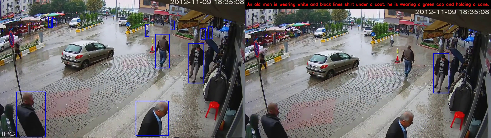

# SF_APIs
Scripts for using Sensus Futuris APIs

Please check the sample codes in scripts to call various Sensus Futuris APIs.

## Face Detection API - Version 1.0
Detect human faces in an image, return face rectangles. 
* Supported image types are JPG/ JPEG, PNG, WEBP, BMP.
* Max image file pixel size is 1000.
* Max file upload size is 2.5Mb. 

### Response 200
Json response containing list of face rectangles
```
{
    "face_locations": [
        [
        100,
        84,
        261,
        285
        ],
        [..]
    ]
}
```

The coordinates in face rectangle can be displayed as in the following example.

<p align="center">
  
</p>

## Face Embedding API - Version 1.0
Detect human faces in an image, return face rectangles and embeddings against each detected face. 
* Supported image types are JPG/ JPEG, PNG, WEBP, BMP.
* Max image file pixel size is 1000.
* Max file upload size is 2.5Mb. 

### Response 200
Json response containing list of face rectangles and embeddings
```
{
    "face_locations": [
        [
        100,
        84,
        261,
        285
        ],
        [..]
    ],
    "face_embeddings": [
        [   
        -0.013276094570755959,
        0.004762198776006699,
        -0.014785194769501686,
        -0.04084409028291702,
        0.044945213943719864,
        0.03469116985797882,
        .
        .
        .
        ],
        [...]
    ]
}
```
## Appearance Embedding API - Version 1.0
Detect persons in an image, return embeddings against each detected person.  
* Supported image types are JPG/ JPEG, PNG, WEBP, BMP.
* Max image file pixel size is 1000.
* Max file upload size is 2.5Mb. 
* The embedding is a 512 dimensional vector.

### Response 200
Json response containing embeddings with the following key:

    * person_locations
        containing 4 floating point numbers [x1, y1, x2, y2]
        (x1, y1) is the pixel location of top left corner of the detected person
        (x2, y2) is the pixel location of bottom right corner of the detected person
    * appearance_embedding
        containing 512 floating point numbers

```
{
    "person_locations": [
        [
        35.38322448730469,
        78.49273681640625,
        621.88623046875,
        477.7815856933594
        ]
    ],
    "appearance_embedding": [
        [   
        0.43633073568344116,
        1.3747670650482178,
        2.0888354778289795,
        0.860216498374939,
        -0.5311746597290039,
        3.2140378952026367,
        .
        .
        .
        ],
        [...]
    ]
}
```

The coordinates in face rectangle can be displayed as in the following example.

<p align="center">
  
</p>

##  Language Embedding API - Version 1.0
Return embeddings against text sentence(s) provided. 
* Supported query is text string or multiple text strings seperated by ::. e.g "A person wearing red shirt" or "A person wearing blue jeans::A girl wearing floral top" 
* The embedding is a 512 dimensional vector. 

### Response 200
Json response containing embeddings with the following key:

    * language_embedding
        containing 512 floating point numbers

```
{
    "language_embedding": [
        [   
        0.43633073568344116,
        1.3747670650482178,
        2.0888354778289795,
        0.860216498374939,
        -0.5311746597290039,
        3.2140378952026367,
        .
        .
        .
        ],
        [...]
    ]
}
```
## Search Language to Appearance
The search can be performed by getting cosine similarity between the language and appearance features. 

### Cosine Similarity
Cosine similarity can be calculated using Python library called Sklearn 

```
from sklearn.metrics.pairwise import cosine_similarity
    
    #load all appearance features
    all_appearance_data =np.load('path_to_appearance_features.npy', allow_pickle=True)
    
    #load person detections
    all_pd_data = np.load('path_to_person_detection.npy', allow_pickle=True).tolist()
    
    #read language feature
    lang = np.expand_dims(np.array(lang_feat), axis=0)
    
    #get cosine similarity
    z = cosine_similarity(vis, Y=lang)
    
    #get matching index of person detection
    max_idx = np.argmax(z)
    
    #get the matched person detection for diplaying purpose
    matched_pd = pd[max_idx]
```


### Example Language to Appearance Searches
<p align="center">
  
</p>
<p align="center">
  
</p>
<p align="center">
  
</p>
<p align="center">
  
</p>
<p align="center">
  
</p>
<p align="center">
  
</p>